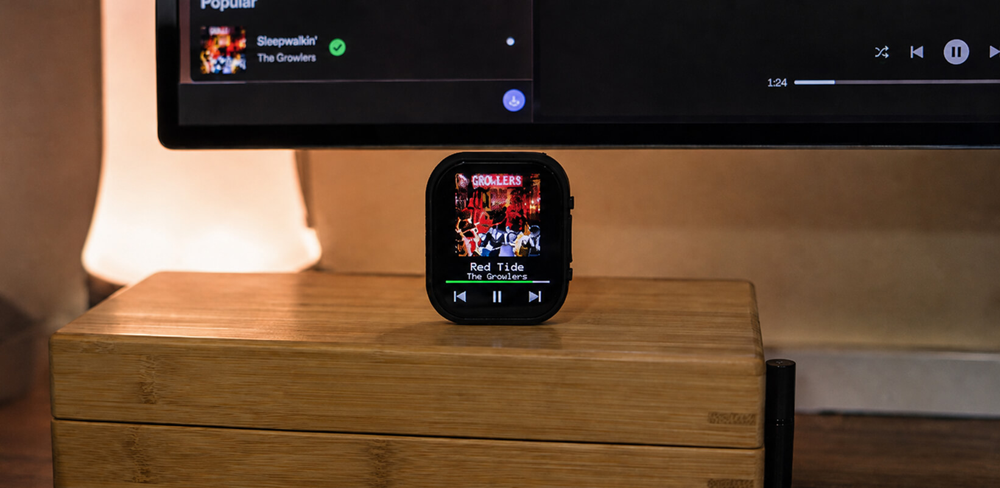

# ESP32 Spotify Remote



A standalone port of the ESP32 Spotify-remote idea to the
[Waveshare ESP32-S3-Touch-AMOLED-2.06](https://www.waveshare.com/wiki/ESP32-S3-Touch-AMOLED-2.06).
It targets the board's **410 × 502 CO5300 QSPI AMOLED** and **FT3168-compatible
capacitive touch controller**.

This snapshot was rebuilt as a real repository after an earlier response claimed
that a fork and ZIP had been published when they had not. It is a clean-room
implementation inspired by
[ThingPulse/esp32-spotify-remote](https://github.com/ThingPulse/esp32-spotify-remote),
not a hidden or inaccessible GitHub fork.

## Features

- Automatic four-side rotation using the onboard QMI8658 accelerometer
- Portrait and landscape layouts for the 410 × 502 AMOLED
- Previous, play/pause, and next touch controls
- Current title, artists, album artwork, playback state, and progress
- Spotify Authorization Code **with PKCE**; no client secret in firmware
- Refresh-token persistence in ESP32 NVS
- Verified HTTPS using a maintained Mozilla root-certificate bundle
- Album-art download and atomic replacement in LittleFS
- Local setup page at `http://spotify-remote.local`
- A loopback OAuth helper compatible with Spotify's redirect-URI rules
- PlatformIO CI and repository checks that reject insecure TLS shortcuts

Spotify playback-control endpoints require an eligible Spotify account and an
active Spotify player.

## 1. Prepare the project

Install VS Code with PlatformIO, or PlatformIO Core directly. Then:

```bash
cp include/secrets.example.h include/secrets.h
```

Edit `include/secrets.h`:

```cpp
#define WIFI_SSID "your network"
#define WIFI_PASSWORD "your password"
#define SPOTIFY_CLIENT_ID "your Spotify app client ID"
```

The file is ignored by Git. Do not add a Spotify client secret; PKCE is used.

## 2. Configure Spotify

Create an app in the Spotify Developer Dashboard and add this redirect URI
**exactly**:

```text
http://127.0.0.1:4381/callback
```

Spotify allows HTTP for explicit loopback IP literals; `localhost` and an HTTP
`.local` callback are not used.

## 3. Build and flash

```bash
pio run
pio run --target upload
pio device monitor
```

LittleFS is formatted automatically on first boot, so a separate filesystem
upload is not required. The `data/` directory is kept for optional future assets.

## 4. Authorize Spotify

The ESP32 and computer must be on the same Wi-Fi.

From the repository root, run:

```bash
python3 tools/spotify_oauth_bridge.py
```

Then open:

```text
http://spotify-remote.local
```

Click **Authorize with Spotify**. Spotify returns to the loopback helper, which
forwards the short-lived callback parameters to the ESP32. Token exchange and
storage happen on the ESP32.

If `.local` resolution is unavailable, use the IP shown on the device and pass it
to the helper:

```bash
python3 tools/spotify_oauth_bridge.py --device-url http://192.168.1.123
```

## Security choices

- `setInsecure()` is intentionally absent.
- A maintained root bundle validates Spotify API and image-CDN certificates.
- A fresh secure client is configured for every request and redirect hop.
- The firmware waits for SNTP time before making TLS requests.
- OAuth uses PKCE and validates `state`.
- Tokens and authorization codes are never written to serial logs.
- The browser helper never sees the access or refresh token.

## Repository layout

```text
include/Config.h             non-secret behavior and timing
include/secrets.example.h    credential template
src/BoardDisplay.*           CO5300/QSPI board adapter
src/OrientationSensor.*      QMI8658 four-side orientation sensing
src/TouchController.*        FT3168-compatible I2C touch
src/SpotifyClient.*          PKCE, API, controls, artwork
src/OAuthPortal.*            local setup web server
src/AppUi.*                  410 × 502 UI
src/main.cpp                 application lifecycle
partitions/                  16 MB flash layout
tools/spotify_oauth_bridge.py
.github/workflows/           CI build
```

## Status and physical-board validation

The repository is structured for the exact Waveshare board and uses its published
pin map, panel constructor, dimensions, and offsets. A physical-device pass is
still required before calling it production-tested. See
[`docs/TESTING.md`](docs/TESTING.md) for the bring-up checklist.

## Attribution and license

Project code is MIT licensed. See [`NOTICE.md`](NOTICE.md) for upstream and
third-party attribution.
